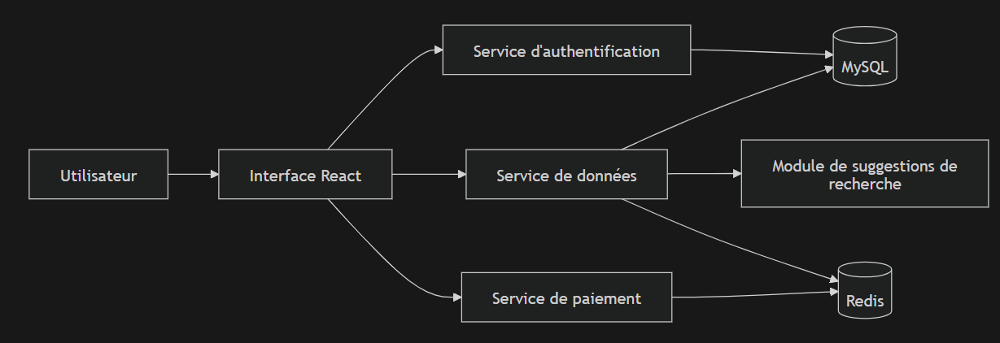

# ECF4 – Microservices E-commerce

## 1. Portée

Ce projet contient une plateforme e-commerce partielle basée sur une architecture microservices.

**Composants applicatifs :**

- Interface utilisateur React (servie via Nginx)
- 3 microservices Spring Boot
- Base de données MySQL
- Cache Redis

**Ce document couvre :**

- L'architecture actuelle (état "as-is")
- L'architecture cible (état "to-be")
- Les choix techniques et compromis
- Les instructions de déploiement avec Docker Compose et Kubernetes (kind)

---

## 2. Architecture actuelle (As-Is)

### Composants

| Composant                 | Technologie   | Port interne | Port Docker Compose |
|---------------------------|---------------|--------------|---------------------|
| `client`                  | React + Nginx | 80           | 10000               |
| `authentication-service`  | Spring Boot   | 8081         | 7000                |
| `common-data-service`     | Spring Boot   | 8082         | 9000                |
| `payment-service`         | Spring Boot   | 8083         | 9050                |
| `mysql`                   | MySQL 8       | 3306         | 3306                |
| `redis`                   | Redis 7       | 6379         | 6379                |

### Diagramme de composants



---

## 3. Analyse critique

### Principales faiblesses

1. Couplage fort entre l’UI et les services backend : L’interface React appelle directement chaque microservice via son port, rendant difficile l'évolution des services.
2. Gestion des erreurs limitée : pas de mécanisme automatique pour réessayer ou ignorer le service temporairement.
3. Peu d’informations sur le fonctionnement interne : pas de suivi centralisé ni de statistiques détaillées sur ce que font les services.
4. Secrets exposés : Les mots de passe et clés (ex. MySQL, Redis) sont stockés en clair dans les fichiers de configuration, ce qui n’est pas sûr, même pour le développement.
5. Pas de préparation pour Kubernetes : Aucun fichier de déploiement Kubernetes n’était présent au départ. 

### Améliorations apportées

1. Dockerisation complète de chaque service
2. Manifests Kubernetes prêts à l’emploi dans `k8s/` (un fichier par ressource) pour un dépoliement dans un cluster kind.
3. Persistance des données : utilisation de PV + PVC pour assurer la persistance des données MySQL.
4. ConfigMap centralisé pour toutes les variables d'environnement (`REDIS_HOST`, `REDIS_PORT`, `REDIS_PASSWORD`, etc.).
5. Secret Kubernetes pour les informations sensibles (credentials MySQL, clé Stripe).
6. Cluster kind configuré dans `kind/basic-cluster.yaml` avec mapping de port NodePort → hôte.
7. Documentation consolidée avec architecture et instructions de déploiement.

---

## 4. Service de suggestions de recherche

La fonctionnalité de suggestions est implémentée dans `common-data-service` via :

- `GET /default-search-suggestion` – suggestions par défaut
- `GET /search-suggestion?q=...` – suggestions filtrées par mot-clé

**Remarque :** implémenté comme module interne du service commun, pas comme microservice séparé.

**Compromis :**

| Approche | Avantage | Inconvénient |
|---|---|---|
| Module interne | Livraison rapide, moins de complexité opérationnelle | Scalabilité couplée au reste du service |
| Microservice dédié | Isolation stricte, déploiement indépendant | Surcharge opérationnelle pour ce périmètre |

---

## 5. Architecture cible (To-Be)

**Principes retenus :**

1. Limites claires entre les services avec contrats explicites (API).
2. Déploiement conteneurisé pour chaque composant.
3. Modèle Kubernetes natif : Deployments, Services, ConfigMap, Secret, PVC.
4. Gateway centralisée (Ingress ou API Gateway) pour éliminer le couplage UI → ports directs.
5. Sécurisation progressive : probes readiness/liveness, limites de ressources, externalisation des secrets.

---

## 6. Docker Compose – Build et exécution

Depuis la racine du projet :

```bash
docker-compose up --build
```

**Ports exposés :**

| Service           | URL                       |
|-------------------|---------------------------|
| Interface React   | http://localhost:10000    |
| Auth service      | http://localhost:7000     |
| Common data       | http://localhost:9000     |
| Payment service   | http://localhost:9050     |
| MySQL             | localhost:3306            |
| Redis             | localhost:6379            |

---

## 7. Déploiement Kubernetes (kind)

### Pré-requis

- [Docker Desktop](https://www.docker.com/products/docker-desktop/) installé et en cours d'exécution
- [kind](https://kind.sigs.k8s.io/) installé
- [kubectl](https://kubernetes.io/docs/tasks/tools/) installé

### Étape 1 – Créer le cluster kind

```bash
kind create cluster --config kind/basic-cluster.yaml
```

Le fichier `kind/basic-cluster.yaml` configure un cluster nommé `ecf4` avec 1 control-plane et 2 workers.
Le port NodePort 30080 est mappé vers le port hôte 30080.

### Étape 2 – Construire les images Docker

```bash
docker build -t ecf4-authentication-service:latest ./server/authentication-service
docker build -t ecf4-common-data-service:latest    ./server/common-data-service
docker build -t ecf4-payment-service:latest        ./server/payment-service
docker build -t ecf4-client:latest                 ./client
```

### Étape 3 – Charger les images dans le cluster kind

```bash
kind load docker-image ecf4-authentication-service:latest --name ecf4
kind load docker-image ecf4-common-data-service:latest    --name ecf4
kind load docker-image ecf4-payment-service:latest        --name ecf4
kind load docker-image ecf4-client:latest                 --name ecf4
```

> **Important :** Les images doivent être chargées dans kind avant d'appliquer les manifests.
> `imagePullPolicy: IfNotPresent` est utilisé pour que Kubernetes utilise les images locales
> sans tenter de les télécharger depuis Docker Hub.

### Étape 4 – Appliquer les manifests

```bash
kubectl apply -f k8s/
```

### Étape 5 – Validation

```bash
kubectl get all -n ecf4
kubectl get pvc -n ecf4
```

**Résultat attendu :** 6 pods en état `Running 1/1` :

| Pod                        | Image                                |
|----------------------------|--------------------------------------|
| `authentication-service`   | `ecf4-authentication-service:latest` |
| `common-data-service`      | `ecf4-common-data-service:latest`    |
| `payment-service`          | `ecf4-payment-service:latest`        |
| `client`                   | `ecf4-client:latest`                 |
| `mysql`                    | `mysql:8`                            |
| `redis`                    | `redis:7-alpine`                     |

L'interface est accessible sur **http://localhost:30080** une fois tous les pods démarrés.

### Ports exposés en Kubernetes

| Composant | Type de service | Port | Exposition externe |
|---|---|---|---|
| `client` | NodePort | 30080 | Oui (via `localhost:30080`) |
| `authentication-service` | ClusterIP | 8081 | Non |
| `common-data-service` | ClusterIP | 8082 | Non |
| `payment-service` | ClusterIP | 8083 | Non |
| `mysql` | ClusterIP | 3306 | Non |
| `redis` | ClusterIP | 6379 | Non |

### Point d'attention frontend (état actuel)

Le frontend est compilé avec des valeurs par défaut API basées sur `localhost:7000`, `localhost:9000` et `localhost:9050` (voir `client/Dockerfile` et `client/src/api/service_api.js`).

En Kubernetes, ces ports backend ne sont pas exposés publiquement (services en `ClusterIP`).
Concrètement, seule l'UI est exposée en externe via `localhost:30080`.

Pour un fonctionnement complet de bout en bout dans Kubernetes, il faut ensuite :

1. soit exposer les APIs (Ingress / NodePort / port-forward),
2. soit ajouter un reverse proxy Nginx côté client pour router les requêtes vers les services internes du cluster.

### Structure des manifests

```
k8s/
  00-namespace.yaml            # Namespace ecf4
  01-configmap.yaml            # Variables d'environnement (DB_HOST, REDIS_HOST, REDIS_PASSWORD…)
  02-secret.yaml               # Secrets (credentials MySQL, clé Stripe)
  03-mysql-pv.yaml             # PersistentVolume (hostPath /mnt/data/ecf4-mysql)
  04-mysql-pvc.yaml            # PersistentVolumeClaim lié au PV
  05-mysql-deployment.yaml
  06-mysql-service.yaml
  07-redis-deployment.yaml
  08-redis-service.yaml
  09-authentication-deployment.yaml
  10-authentication-service.yaml
  11-common-data-deployment.yaml
  12-common-data-service.yaml
  13-payment-deployment.yaml
  14-payment-service.yaml
  15-client-deployment.yaml
  16-client-service.yaml       # NodePort 30080
```

---

## 8. Décisions architecturales et compromis

| Décision | Justification |
|---|---|
| Décomposition des services conservée | Périmètre obligatoire respecté |
| Suggestions dans `common-data-service` | Priorité à la rapidité de livraison |
| MySQL avec PVC (hostPath) | Persistance des données entre redémarrages de pod |
| Redis sans PVC | Cache volatile, pas de besoin de persistance |
| `imagePullPolicy: IfNotPresent` | Nécessaire pour utiliser les images locales chargées via kind |
| Un fichier YAML par ressource | Lisibilité et alignement avec les pratiques du cours |
| `REDIS_PASSWORD: ""` dans le ConfigMap | `DevRedisConfig.java` exige la présence de cette variable (NPE sinon) |
